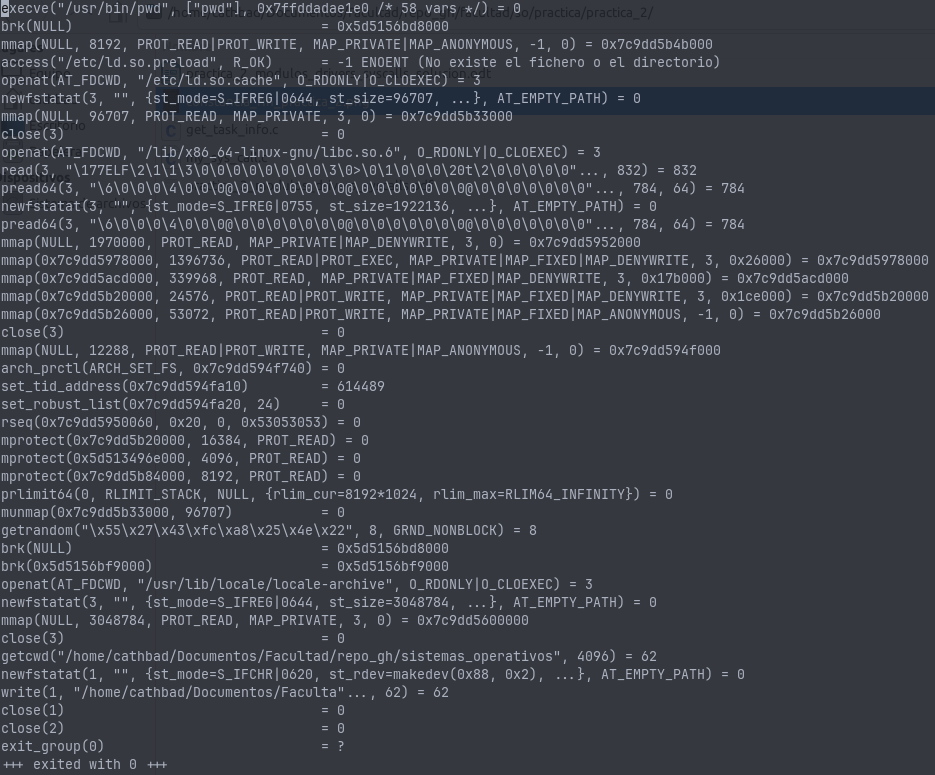

# System Calls

## Conceptos generales

1. ¿Qué es una System Call? ¿Para qué se utiliza?

    Una **System Call** (llamada al sistema) es el **mecanismo principal** que un **proceso en modo usuario utiliza para solicitar un servicio al Sistema Operativo (SO)**. El SO actúa como un intermediario entre el usuario de una computadora y su hardware.

    Las System Calls se utilizan para varios propósitos fundamentales:
    - **Acceso a hardware.**
    - **Ejecución de instrucciones privilegiadas.**
    - **Protección y seguridad.**
    - **Portabilidad.**
2. ¿Para qué sirve la macro syscall? Describa el propósito de cada uno de sus parámetros.

    La macro `syscall` en la biblioteca C de GNU (glibc) sirve para realizar una **llamada al sistema genérica**. Permite que un proceso en espacio de usuario solicite directamente un servicio específico al kernel que, por lo general, implica el control de un dispositivo o la ejecución de una instrucción privilegiada. Aunque los desarrolladores suelen interactuar con APIs de más alto nivel (como las funciones de `libc` que actúan como "wrappers"), `syscall` ofrece una **invocación explícita**.

    La macro `syscall` tiene la siguiente estructura y parámetros:
    - **`long int sysno`**:
        - Este parámetro representa el **número de la llamada al sistema** que se desea ejecutar.
        - Cada tipo de llamada al sistema se identifica mediante un **número único**.
        - Existen macros definidas en `sys/syscall.h` para identificar estos números, por ejemplo, `SYS_chmod` o `SYS_gettimeofday`.
        - En arquitecturas como x86 de 32 bits, este número se carga en el registro EAX.
    - `...` (parámetros variables):
        - Estos son los **argumentos de la llamada al sistema específica**, que se pasan en orden.
        - La cantidad y el significado de estos argumentos d**ependen completamente del tipo de llamada al sistema** que se esté invocando.
        - Una llamada al sistema puede tener un número definido de argumentos, **desde cero hasta cinco**, **o un máximo de seis en GNU/Linux**. Si se proporcionan más argumentos de los que la llamada espera, los argumentos adicionales se ignoran.
        - Los parámetros (especialmente los punteros) deben manejarse con cuidado, ya que se configuran en el espacio de usuario. Por razones de seguridad, **no deben apuntar al espacio del kernel** y deben ser válidos para evitar errores como un "Kernel Panic".
        - La macro `asmlinkage` puede ser utilizada para indicar al compilador cómo pasar estos parámetros (por ejemplo, a través del stack en sistemas x86 de 32 bits o mediante registros en otras arquitecturas).

    El valor de retorno de syscall será el valor que retorne la system call salvo que la system call falle en ese caso el valor de retorno de syscall es -1 y setea errno con con el código de error que retorno la system call.

    Ayuda: <http://www.gnu.org/software/libc/manual/html_mono/libc.html#System-Calls>
3. Ejecute el siguiente comando e identifique el propósito de cada uno de los archivos que encuentra

    `ls -lh /boot | grep vmlinuz`

    Lista los archivos `vmlinuz*` que son las imágenes compiladas del kernel de Linux.
    Los usuarios tienen la capacidad de personalizar y compilar versiones del kernel. Una vez compilado, la imagen del kernel (`bzImage` para i386) se copia al directorio `/boot` y se nombra siguiendo una convención como `vmlinuz-version` (por ejemplo, `vmlinuz-6.13.7`).
4. Acceda al codigo fuente de GNU Linux, sea visitando <https://kernel.org/> o bien trayendo el código del kernel(cuidado, como todo software monolítico son unos cuantos gigas)

    `git clone https://github.com/torvalds/linux.git`
5. ¿Para qué sirven el siguiente archivo?
    `arch/x86/entry/syscalls/syscall_64.tbl`

    El archivo `arch/x86/entry/syscalls/syscall_64.tbl` sirve para definir **la tabla de llamadas al sistema** para la arquitectura x86 de 64 bits.

    El propósito de este archivo es:
    - **Identificación de llamadas al sistema:** Cada tipo de llamada al sistema se identifica mediante un **número único**. Este archivo contiene un mapeo de esos números a los nombres de las llamadas al sistema y sus puntos de entrada (funciones manejadoras).
    - **Mecanismo del kernel:** Es una parte fundamental del proceso mediante el cual el kernel de Linux determina qué función manejadora invocar cuando un proceso en espacio de usuario realiza una llamada al sistema. Cuando se produce una interrupción para una llamada al sistema (como la instrucción **syscall** en AMD64/x86_64), el dispatcher del kernel verifica el número de la llamada en esta tabla para ejecutar la función asociada.
    - **Organización del código fuente:** El código fuente del *kernel* de Linux está organizado por arquitectura, y este archivo es específico para la arquitectura x86 de 64 bits.
    - **Desarrollo y personalización:** Es necesario agregar una entrada a esta tabla y considerar un número de llamada al sistema único al desarrollar una nueva llamada al sistema en GNU/Linux.
6. ¿Para qué sirve la herramienta strace? ¿Cómo se usa?

    La herramienta `strace` sirve para **reportar las llamadas al sistema (syscalls) invocadas por un proceso**. Su propósito es **monitorear las syscalls** que un programa realiza durante su ejecución.

    **Cómo se usa `strace`:**

    Se invoca strace seguido del comando o programa que se desea monitorear.

    - Un ejemplo de uso básico es: `strace -o pwd.out pwd > /dev/null`. Este comando ejecutaría el programa `pwd` y enviaría la salida de `strace` (el reporte de syscalls) al archivo `pwd.out`.

    Al usar `strace`, se puede observar la secuencia de llamadas al sistema que el programa realiza, lo cual es útil para depurar, entender el comportamiento del programa o analizar problemas relacionados con interacciones con el kernel. La salida de `strace` muestra detalles como el nombre de la syscall, sus argumentos y el valor de retorno, como en el ejemplo 

7. ¿Para qué sirve la herramienta ausyscall? ¿Cómo se usa?

    Se utiliza para mapear números de syscalls con sus nombres y viceversa, obtener el número de una syscall específica o ver diferencias entre arquitecturas. Es parte del paquete auditd.
    Se utiliza por ejemplo de las siguientes manera:

    - `ausyscall <sysno>`

      - `ausyscall  1`:

        write

    - `ausyscall –-dump`

        Devuelve el lista de todas las syscalls sysno y nombre.

## Práctica guiada

**¿Para qué sirven los macros SYS_CALL_DEFINE?**

Los macros `SYS_CALL_DEFINE` son parte de la **API del kernel** de Linux y sirven para definir syscalls de manera segura y estandarizada. El numero indica la cantidad de argumentos `SYSCALL_DEFINE0`, sin argumentos, `SYSCALL_DEFINE1`, un argumento, y así hasta `SYSCALL_DEFINE6`, con seis argumentos.

**¿Para que se utilizan la macros for_each_process y for_each_thread?**

Las macros `for_each_process` y `for_each_thread` son utilizadas en el kernel de Linux para **iterar sobre procesos (tasks) e hilos (threads) de manera segura y eficiente**. Son fundamentales para recorrer las estructuras de administración de procesos del kernel.

**¿Para que se utiliza la función copy_to_user?**

Se utiliza para transferir datos del kernel a una aplicación en el espacio de usuario, evitar accesos inválidos a memoria de usuario, **garantiza la seguridad y estabilidad**.

**¿Para qué se utiliza la función printk?, ¿porque no la típica printf?**

**`printk` (print kernel)** es la función estándar en el kernel de Linux para mostrar mensajes de registro (logs) desde el espacio del kernel. `prinft` solo se usa en el espacio de usuario, depende de la `libc`, la salida va a stdout/stderr, solo muestra texto plano.
**printk es el equivalente a printf pero para el kernel.**

**¿Podría explicar que hacen las sytem call que hemos incluido?**

Se definen 3 syscalls, la primera imprime en el espacio del kernel “My syscall called with arg: argumento” donde argumento es el argumento que se le paso por parámetro. La segunda imprime información de cata proceso: PID, Nombre y Estado. La tercera imprime información de cada hilo de cada proceso: COMM, PID y por cada uno imprime el COMM del hilo y el TID del hilo.
